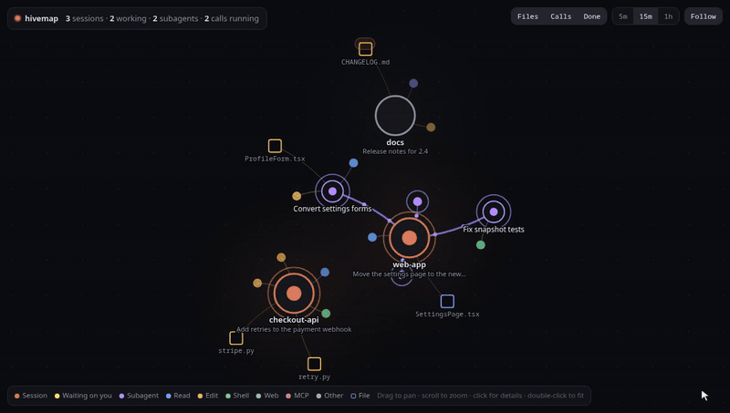
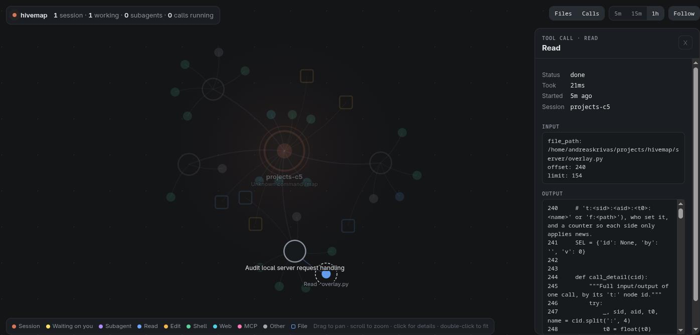

# hivemap

[](https://github.com/andreas131989/hivemap/actions/workflows/test.yml)

A live map of your running [Claude Code](https://claude.com/claude-code) sessions: their subagents, the tool
calls they're making, the files they touch, and which ones are waiting on you.



Two views of the same data, kept in sync:

- **Web map:** a live graph in a browser window. Sessions, subagents, calls and files are nodes; click any of
  them for details, including a call's full input and output.
- **Terminal view:** a session/agent tree with an inspector beside it, for keyboard and mouse. Runs in any
  terminal, or in a pane next to the session you're working in.

Select something in one view and the other follows.

When a session stops for you, it turns yellow and says why, you get a desktop notification, and one click (or
`enter` in the terminal view) takes you to its tmux or herdr pane. The same, in the terminal view:

```
▾ 1 ! checkout-api  84k              │checkout-api  waiting: permission prompt · opus-5-5 · 84k ctx · pid 378235
  main  Bash                         │/home/dev/code/checkout-api
▾ 2 ● web-app  84k                   │Add retries to the payment webhook
  main  Agent                        │──────────────────────────────────────────────────────────────────────────
    └ Accessibility audit  Grep      │20:35:41 Prompt   the stripe webhook drops events when the db is slow, add
    └ Fix snapshot tests  Bash       │20:35:51 Read     stripe.py  1s
    └ Convert settings forms  Edit   │20:36:01 Grep     def handle_event  1s
▾ 3 ○ docs  84k                      │20:36:21 Edit     stripe.py  1s
  main  Edit                         │20:36:41 Write    retry.py  1s
                                     │20:37:11 Bash     Run the webhook tests  12s
                                     │20:42:01 Bash     Push the branch  3m
                                     │
                                     │
↑↓ select · ←→ fold · enter jump · tab calls · f follow · d hide done · q quit
```

Click any tool call to see exactly what it did:



hivemap only reads the files Claude Code already writes under `~/.claude` (session list and transcripts). It
sends nothing anywhere and serves only on `127.0.0.1`. Not affiliated with Anthropic.

## Requirements

- Linux or macOS (CI runs the whole suite on both, including launching the map window on macOS)
- Python 3.9 or newer, standard library only
- `bash`, `curl` and `pkill` (standard on most distributions)
- Chrome, Chromium, Brave or Edge for the web map window (anything else opens in your default browser)
- Optional: [tmux](https://github.com/tmux/tmux) or [herdr](https://herdr.dev), so hivemap can jump to the pane
  a session is running in.
- Optional: `notify-send` (Linux) for desktop notifications; macOS has them built in.

## Install

In Claude Code:

```sh
claude plugin marketplace add andreas131989/hivemap
claude plugin install hivemap@hivemap
```

That gives you `/hivemap:map` (run `/reload-plugins` if Claude Code was already open). That's all most people need.

Optionally, for a `hivemap` command in your shell too, clone the repo and link it into a folder on your `PATH`:

```sh
git clone https://github.com/andreas131989/hivemap ~/.local/share/hivemap
mkdir -p ~/.local/bin && ln -s ~/.local/share/hivemap/bin/hivemap ~/.local/bin/hivemap
```

`~/.local/bin` is on the `PATH` on most Linux systems but not on macOS; there, add it once with
`echo 'export PATH="$HOME/.local/bin:$PATH"' >> ~/.zshrc` and open a new terminal. For fish completions:
`ln -s ~/.local/share/hivemap/fish/hivemap.fish ~/.config/fish/completions/`.

## Use

| In Claude Code | In a shell | What it does |
|---|---|---|
| `/hivemap:map` | `hivemap` | Start the server if needed and open the web map |
| `/hivemap:map pane` | `hivemap pane` | Open the terminal view in a new tmux or herdr pane beside this one |
| | `hivemap tui` | Open the terminal view in this terminal |
| `/hivemap:map start` | `hivemap start` | Start the server only (`serve` works too) |
| `/hivemap:map status` | `hivemap status` | Say whether the server is running |
| `/hivemap:map stop` | `hivemap stop` | Stop the server |

The server keeps running in the background after you close the map (it uses well under 1% of a CPU core), so
notifications keep coming and the map opens instantly next time. `stop` ends it.

**Web map:** drag to pan, scroll or `+` / `-` to zoom, click a node for details. Dragging a node pins it;
double-click it to let go. Click a tool call, as a node or as a row in the side panel, to see its full input
and output. **Follow** (or `f`, or double-clicking empty space) keeps the camera fitted to the map;
`5m` / `15m` / `1h` sets how much history is shown; **Done** hides subagents that have finished.
Drag the side panel's left edge to resize it (double-click the edge to reset), or use its **⇤** button to widen it;
`Esc` closes it.

**Terminal view:**

| Keys | |
|---|---|
| `↑` `↓` or `j` `k` | Select a session or agent; its tool calls show on the right |
| `←` `→`, `h` `l` or space | Fold or unfold a session |
| `enter` or `1`–`9` | Jump to that session's tmux or herdr pane |
| `tab` | Move into the call list: `↑` `↓` pick a call, `enter` or `→` opens its input and output, `←`, `tab` or backspace goes back |
| `pgup` `pgdn` | Scroll |
| `f` | Follow the top session (waiting first, then busy) and its most recently active agent |
| `d` | Hide or show subagents that have finished |
| `q` | Quit |

The mouse works too: click a row or a call to select or open it, click a selected session to fold it, and
scroll with the wheel.

**Waiting on you:** when Claude Code stops for you (a permission prompt, for example), the session turns yellow, moves to the
top in both views and shows why ("waiting: permission prompt"), and the web map's window title shows the count.

**Notifications:** you get a desktop notification when a session starts waiting on you, and when one finishes
a turn that took longer than 30 seconds. To turn them off, set `HIVEMAP_NOTIFY=0` in the environment the server
starts from (your shell profile, before starting Claude Code) and restart it with `stop` then `start`.

On **macOS** the notifications come from `osascript`, so macOS lists them under **Script Editor**. If none show
up, allow notifications for Script Editor in System Settings → Notifications. On **Linux** they need
`notify-send` (package `libnotify-bin` on Debian and Ubuntu, `libnotify` elsewhere).

## Uninstall

```sh
claude plugin uninstall hivemap@hivemap
claude plugin marketplace remove hivemap
```

Run `/hivemap:map stop` first if the server is running. hivemap writes one file of its own: its log,
`~/.local/state/hivemap.log` (or under `$XDG_STATE_HOME`); delete it if you like. The web map also remembers two
display settings (time window, panel width) in your browser's storage for `127.0.0.1`. It never changes anything
under `~/.claude` or your Claude Code settings. If you cloned the repo for the shell command, remove that
folder and the `~/.local/bin/hivemap` link too.

## How it works

`server/overlay.py` tails Claude Code's transcript files and serves the current state as JSON; the web page
(`server/index.html`) polls it every second. The terminal view (`server/tui.py`) reads the same state
directly and syncs its selection through the server. No dependencies beyond the Python standard library.

## Develop

```sh
python3 -m unittest -v   # parser, state, server, terminal view (incl. end to end in a real pty), page, launcher
```

The tests use a throwaway `~/.claude` and a random port, so they never touch your real sessions or a
running hivemap. See [CONTRIBUTING.md](CONTRIBUTING.md) for the ground rules; every change goes through a
pull request and CI on Linux and macOS.

- Port: set `HIVEMAP_PORT` (default `7777`). Log: `$XDG_STATE_HOME/hivemap.log`, which is
  `~/.local/state/hivemap.log` by default.
- Claude Code runs a cached copy of the plugin. After changing files, bump `version` in
  `.claude-plugin/plugin.json` and run
  `claude plugin marketplace update hivemap && claude plugin update hivemap@hivemap`.
- Security issues: see [SECURITY.md](SECURITY.md).

## License

[MIT](LICENSE)
