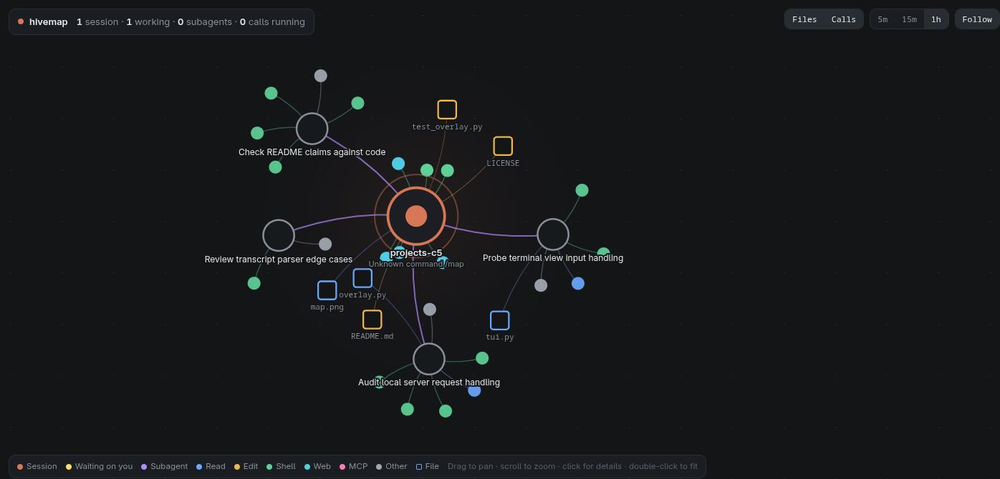

# hivemap

A live map of your running [Claude Code](https://claude.com/claude-code) sessions: their subagents, the tool
calls they're making, the files they touch, and which ones are waiting on you.



Two views of the same data, kept in sync:

- **Web map:** a live graph in a browser window. Sessions, subagents, calls and files are nodes; click any of
  them for details, including a call's full input and output.
- **Terminal view:** a session/agent tree with an inspector beside it, for keyboard and mouse. Runs in any
  terminal, or in a pane next to the session you're working in.

Select something in one view and the other follows.


hivemap only reads the files Claude Code already writes under `~/.claude` (session list and transcripts). It
sends nothing anywhere and serves only on `127.0.0.1`. Not affiliated with Anthropic.

## Requirements

- Linux (the launcher uses `setsid` and Linux browser names; macOS is not supported yet)
- Python 3.9 or newer, standard library only
- `bash`, `curl` and `pkill` (standard on most distributions)
- Chrome, Chromium, Brave or Edge for the web map window (anything else opens in your default browser)
- Optional: [herdr](https://herdr.dev), the terminal workspace manager. With it, hivemap can
  jump to a session's pane and show which sessions are waiting on you.

## Install

In Claude Code:

```sh
claude plugin marketplace add andreas131989/hivemap
claude plugin install hivemap@hivemap
```

That gives you `/hivemap:map`. For the `hivemap` shell command too, clone the repo and link it:

```sh
git clone https://github.com/andreas131989/hivemap ~/.local/share/hivemap
ln -s ~/.local/share/hivemap/bin/hivemap ~/.local/bin/hivemap
# fish completions, optional:
ln -s ~/.local/share/hivemap/fish/hivemap.fish ~/.config/fish/completions/hivemap.fish
```

## Use

| In Claude Code | In a shell | What it does |
|---|---|---|
| `/hivemap:map` | `hivemap` | Start the server if needed and open the web map |
| `/hivemap:map pane` | `hivemap pane` | Open the terminal view in a new herdr pane beside this one |
| | `hivemap tui` | Open the terminal view in this terminal |
| `/hivemap:map start` | `hivemap start` | Start the server only (`serve` works too) |
| `/hivemap:map status` | `hivemap status` | Say whether the server is running |
| `/hivemap:map stop` | `hivemap stop` | Stop the server |

**Web map:** drag to pan, scroll or `+` / `-` to zoom, click a node for details. Dragging a node pins it;
double-click it to let go. Click a tool call, as a node or as a row in the side panel, to see its full input
and output. **Follow** (or `f`, or double-clicking empty space) keeps the camera fitted to the map;
`5m` / `15m` / `1h` sets how much history is shown; `Esc` closes the side panel.

**Terminal view:**

| Keys | |
|---|---|
| `↑` `↓` or `j` `k` | Select a session or agent; its tool calls show on the right |
| `←` `→`, `h` `l` or space | Fold or unfold a session |
| `enter` or `1`–`9` | Jump to that session's herdr pane |
| `tab` | Move into the call list: `↑` `↓` pick a call, `enter` or `→` opens its input and output, `←`, `tab` or backspace goes back |
| `pgup` `pgdn` | Scroll |
| `f` | Follow the top session (waiting first, then busy) and its most recently active agent |
| `q` | Quit |

The mouse works too: click a row or a call to select or open it, click a selected session to fold it, and
scroll with the wheel.

**Waiting on you:** when herdr reports a session as blocked (a permission prompt or a question), it turns
yellow and moves to the top in both views, and the web map's window title shows the count.

## How it works

`server/overlay.py` tails Claude Code's transcript files and serves the current state as JSON; the web page
(`server/index.html`) polls it every second. The terminal view (`server/tui.py`) reads the same state
directly and syncs its selection through the server. No dependencies beyond the Python standard library.

## Develop

```sh
python3 server/test_overlay.py   # self-check for the transcript parser and shared call ids
```

- Port: set `HIVEMAP_PORT` (default `7777`). Log: `$XDG_STATE_HOME/hivemap.log`, which is
  `~/.local/state/hivemap.log` by default.
- Claude Code runs a cached copy of the plugin. After changing files, bump `version` in
  `.claude-plugin/plugin.json` and run
  `claude plugin marketplace update hivemap && claude plugin update hivemap@hivemap`.

## License

[MIT](LICENSE)
